# 📐 UML Diagrams - Literature Review Manager

## 1. Use Case Diagram

```plantuml
@startuml
left to right direction
skinparam packageStyle rectangle

actor "User" as User
actor "System" as System

rectangle "Literature Review Manager" {
  
  package "Authentication" {
    (UC1: Đăng ký/Đăng nhập) as UC1
    (UC2: Quản lý profile) as UC2
  }
  
  package "Paper Management" {
    (UC3: Thêm bài báo mới) as UC3
    (UC4: Chỉnh sửa/Xóa bài báo) as UC4
    (UC5: Upload & Quản lý PDF) as UC5
    (UC6: Tìm kiếm bài báo) as UC6
  }
  
  package "Personal Library" {
    (UC7: Thêm bài báo vào\nthư viện cá nhân) as UC7
    (UC8: Ghi chú & Tag) as UC8
  }
  
  package "Citation Network" {
    (UC9: Tạo quan hệ trích dẫn) as UC9
    (UC10: Xem đồ thị citation) as UC10
  }
  
  package "AI Analysis" {
    (UC11: Sinh tóm tắt\n& phân tích) as UC11
  }
  
  User --> UC1
  User --> UC2
  User --> UC3
  User --> UC4
  User --> UC5
  User --> UC6
  User --> UC7
  User --> UC8
  User --> UC9
  User --> UC10
  User --> UC11
  
  UC3 ..> UC5 : <<include>>
  UC7 ..> UC6 : <<extend>>
  UC8 ..> UC7 : <<extend>>
  UC10 ..> UC9 : <<include>>
  
  System ..> UC11 : <<auto-generate>>
}

@enduml
```

## 2. Class Diagram

## 3. Sequence Diagram - User Login

## 4. Sequence Diagram - Add Paper with Citation

## 5. Sequence Diagram - Generate AI Summary

## 6. Activity Diagram - Search Papers

## 7. Activity Diagram - Citation Network Visualization

---

## 📊 Diagram Tools

To render these diagrams:

1. **PlantUML**: Use VS Code extension "PlantUML" or online editor: https://www.plantuml.com/plantuml/uml/
2. **Draw.io**: Import PlantUML or create custom diagrams
3. **Mermaid**: Alternative syntax supported by GitHub

## 🎯 Key Design Patterns

- **MVC Pattern**: Controller → Service → Repository
- **Dependency Injection**: NestJS IoC container
- **Repository Pattern**: TypeORM entities
- **DTO Pattern**: Request/Response validation
- **Strategy Pattern**: Multiple search strategies
- **Observer Pattern**: Real-time updates (WebSocket)

